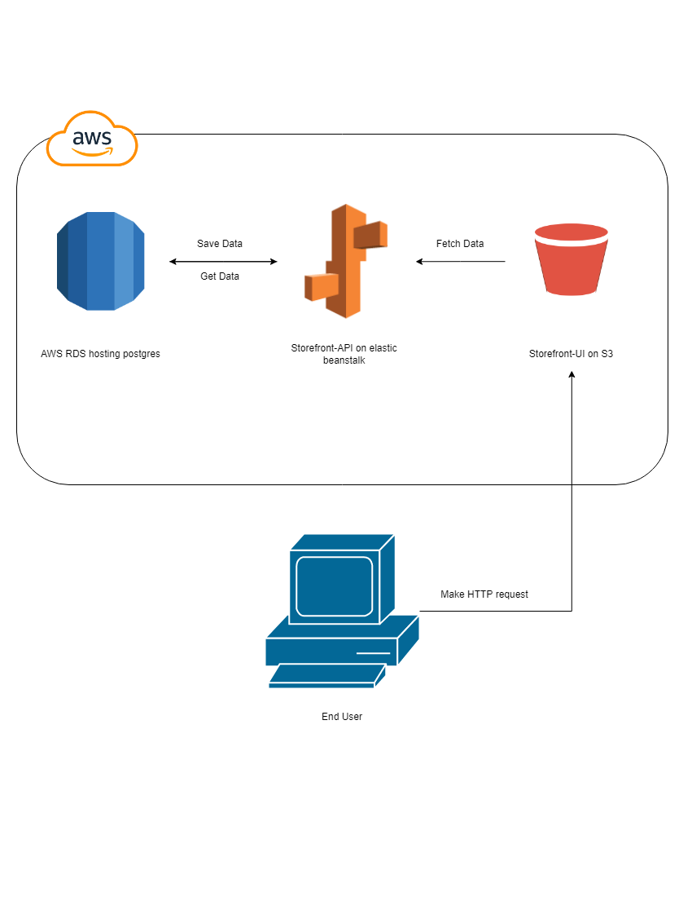

# Infrastructure

#### RDS Databse

running a postgresql database on AWS RDS service

#### Elasticbeanstalk

running the backend server on AWS Elasticbeanstalk service with node14

#### AWS3 Bucket

running the client side on AWS S3 bucket service configured for web hosting with public access

## Infrastructure Diagram

    

