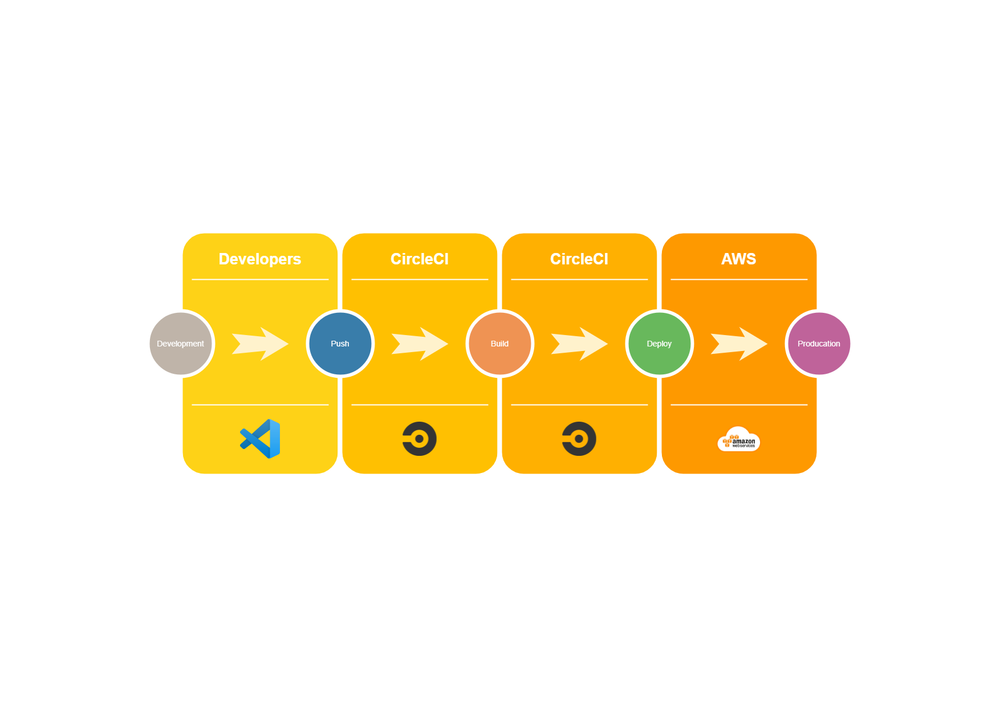

# Pipeline Process

## Pipeline Process

- development
- push code to github
- Trigger pipeline
- install frontend dependencies
- install backend dependencies
- build frontend
- build backend
- deploy both frontend and backend

## CircleCI Pipeline Diagram

    

